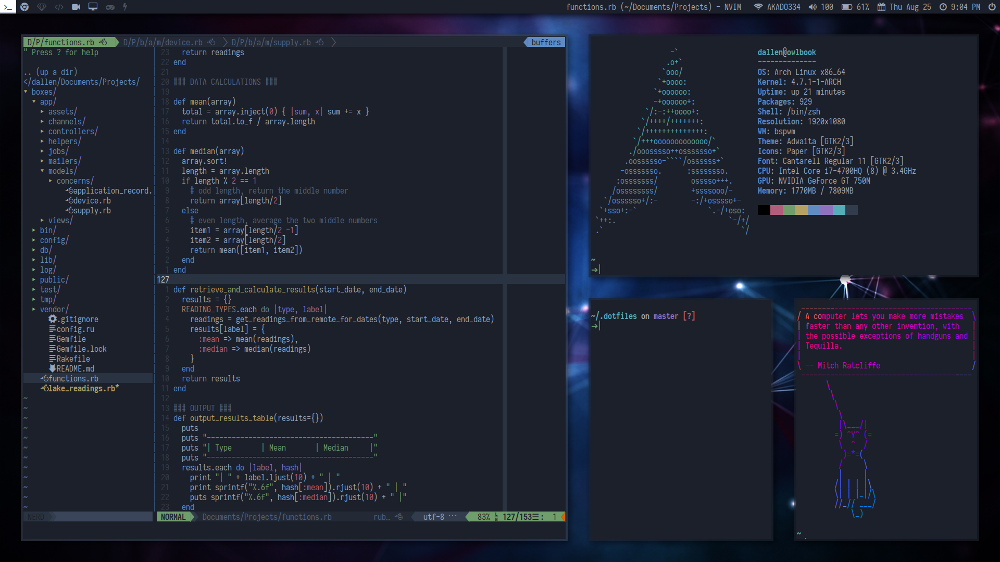

My current Arch Linux setup. I use [stow](https://www.gnu.org/software/stow/) to manage symlinks.

* Vim theme is [Deep Space](https://github.com/tyrannicaltoucan/vim-deep-space).
* Terminal and other colors are Deep Space as well.
* Font is [Iosevka](https://be5invis.github.io/Iosevka/)

